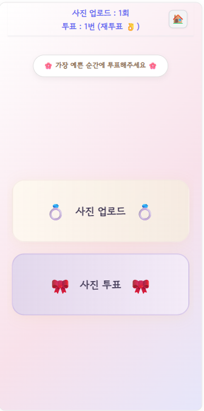

# 💍 Photo Event

하객이 직접 참여하는 **결혼식 사진 이벤트 플랫폼**입니다.  
결혼식장에서 QR코드를 스캔하면, **로그인 없이** 웹 페이지에 접속하여  
직접 사진을 업로드하고, 마음에 드는 사진에 투표할 수 있습니다.  
**Spring Boot + Vue.js** 기반으로 개발되었습니다.



---

## 🔗 QR 생성 사이트

하객 참여용 QR은 다음 사이트에서 쉽게 생성할 수 있습니다:

👉 [https://genqrcode.com/ko/multiple](https://genqrcode.com/ko/multiple)

---

## ✨ 주요 기능

- 📸 **사진 업로드**  
  QR로 접속 후, 본인의 기기로 간단하게 사진을 업로드할 수 있습니다.

- 🎀 **사진 투표**  
  마음에 드는 순간을 투표로 뽑아주세요. 베스트 포토를 함께 만들어갑니다.

- 🔐 **로그인 불필요**  
  별도의 회원가입이나 로그인 없이 바로 참여할 수 있습니다.

---

## 🛠️ 기술 스택

| 구분 | 사용 기술 |
|------|------------|
| Backend | Spring Boot |
| Frontend | Vue.js |
| Build Tool | Gradle |
| Infra | **Heroku**, **NeonDB** |

---

## 🚀 로컬 실행 방법

아래 명령어를 통해 로컬에서 프로젝트를 실행할 수 있습니다:

```bash
# 프론트엔드 실행
cd front
npm install
npm run dev

# 백엔드 실행
cd back
./gradlew bootRun  # Windows는 gradlew.bat 사용
