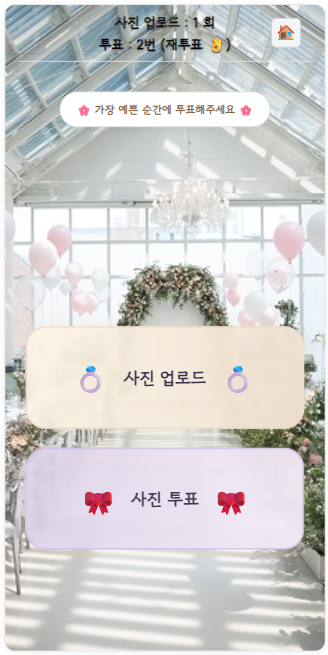

# 💍 Photo Event

하객이 직접 참여하는 **결혼식 사진 이벤트 플랫폼**입니다.  
결혼식장에서 QR코드를 스캔하면, **로그인 없이** 웹 페이지에 접속하여  
직접 사진을 업로드하고, 마음에 드는 사진에 투표할 수 있습니다.  
**Spring Boot + Vue.js** 기반으로 개발되었습니다.



---

## 🔗 QR 생성 사이트

하객 참여용 QR은 다음 사이트에서 쉽게 생성할 수 있습니다:

👉 [https://genqrcode.com/ko/multiple](https://genqrcode.com/ko/multiple)

---

## ✨ 주요 기능

- 📸 **사진 업로드**  
  QR로 접속 후, 본인의 기기로 간단하게 사진을 업로드할 수 있습니다.  
  업로드된 이미지는 **Cloudinary**에 저장되며, 데이터베이스에는 이미지의 URL만 저장됩니다.

- 🎀 **사진 투표**  
  마음에 드는 순간을 투표로 뽑아주세요. 베스트 포토를 함께 만들어갑니다.

- 🔐 **로그인 불필요**  
  별도의 회원가입이나 로그인 없이 바로 참여할 수 있습니다.

---

## 📦 외부 서비스 사용 내역

- **Render**: Spring Boot 애플리케이션 호스팅  
- **NeonDB**: PostgreSQL 기반의 클라우드 데이터베이스  
- **Cloudinary**: 이미지 저장 및 URL 제공

## 🗂️ 아키텍처 요약

- 사용자가 사진을 업로드하면, 이미지 파일은 **Cloudinary**에 저장되고  
- 응답받은 `secure_url`만 **NeonDB(PostgreSQL)** 에 저장됩니다.  
- 이미지 다운로드나 이메일 전송 시에는 해당 URL을 활용하여 Cloudinary에서 직접 불러옵니다.

## 💰 Free Tier 자원 비교

| **서비스**     | **리소스 종류**       | **Free Tier 제공량 (2025 기준)**                                                                 | **초과 시 정책 및 제한 사항**                                                                 |
|----------------|------------------------|--------------------------------------------------------------------------------------------------|----------------------------------------------------------------------------------------------|
| Render         | Web 서비스 (Docker)    | - RAM: 512 MB<br>- 월 750 h 인스턴스<br>- 유휴 시 15분 후 자동 슬립              | - Compute : 월 750 h Limit
| NeonDB         | PostgreSQL Database    | - 저장공간: 0.5 GB<br>- 월 191.9 h  제공<br>- 월 5 GB transfer(egress)<br>- 프로젝트 Max 10개, 브랜치별 Max 500 DB | - Compute : 월 191.9 h Limit<br>&nbsp;&nbsp;(7일 23시간 54분) |
| Cloudinary     | 이미지 저장 및 CDN     | - 매월 25 크레딧 제공<br>&nbsp;&nbsp;1. 25 GB 저장 or <br>&nbsp;&nbsp;2. 25 GB transfer(egress) or<br>&nbsp;&nbsp;3. 25,000 이미지 변환<br>- 이미지, 비디오 Max :  10mb, 100mb | - 크레딧 초과 시 업그레이드 권유<br>- Free 플랜은 시간 제한 없음, 무제한 사용(크레딧 범위 내) |


> ✅ 모든 수치는 2025년 기준 **Free Tier** 기준입니다. 변동 가능성이 있으므로 각 서비스의 공식 문서를 참고하세요.

## 🛠️ 기술 스택

| 구분      | 사용 기술          |
|-----------|-------------------|
| Backend   | Spring Boot       |
| Frontend  | Vue.js            |
| Build Tool| Gradle            |
| Infra     | Render, NeonDB, Cloudinary |

---

## ⚙️ 성능 및 안정성 설계

### 🔁 비동기 업로드 처리

- 사진 업로드 요청은 **Spring의 `@Async` 비동기 처리**로 수행되어  
  사용자는 즉시 응답을 받고, 실제 업로드는 **백그라운드**에서 안전하게 진행됩니다.

- Cloudinary 업로드 중 일시적인 네트워크 실패나 API 오류에 대비해  
  **최대 3회 재시도**, **지수 백오프 방식(delay × 2)** 을 적용했습니다.

- 사용자 입장에서는 **업로드가 즉각 반응**하며, 서버에서는 **안정적인 처리**를 보장합니다.

---

### 🧯 동시 업로드 요청 제한

- 동시 API 호출시 무료 티어 환경(Cloudinary)의 자원 초과를 방지하기 위해  
  **세마포어(Semaphore)** 를 활용하여 **동시 업로드 수를 제한**합니다.

- 동시에 처리할 수 있는 업로드 요청 수는 설정값으로 제어되며,  
  초과 시에는 HTTP 429 응답을 반환하여 서버 안정성을 유지합니다.
```java
if (!semaphore.tryAcquire()) {
    return 429; // Too Many Requests
}
...
finally {
    semaphore.release();
}
```
---

## 🚀 로컬 실행 방법

```bash
# 프론트엔드 실행
cd front
npm install
npm run dev

# 백엔드 실행
cd back
./gradlew bootRun  # Windows는 gradlew.bat 사용
```

---


## ✅ TODO

- [✔] **구독제 기반 기능 개발**
  - ECO 플랜  
    1. [✔] 투표 상위 10장 메일로 전송 
    2. [✔] 사진 업로드 및 투표 1회 
  - Premium 플랜  
    1. [✔] 전체 업로드 사진을 메일로 전송 
    2. [✔] 사진 업로드 및 투표횟수 설정 
    3. [✔] 관리자 투표시간 설정 

- [✔] **병렬 결혼식 이벤트 처리**
  - 1. [✔] 동시에 여러 결혼식 이벤트가 운영될 수 있도록 구조 개선 
  - 2. [✔] 각 결혼식마다 고유 ID를 통해 업로드/투표 데이터 분리 

- [✔] **사진 무단저장 방지**
  - 1. [✔] 마우스 오른쪽클릭, 드래그 방지
  - 2. [✔] Disable Javascript 기능 방지 (img -> canvas)
       
- [✔] **기타사항**
  - 1. [✔] 도메인 관리자 업로드/투표 횟수, 시간설정 가능(Premium Plan)
      - 1-1. [✔] Group별 PLAN 관리
      - 1-2. [✔] 이메일 전송시 Group의 Plan Default반영
  - 2. [✔] 사용자 본인사진 삭제기능
  - 3. [✔] 업로드 사진 1분 Delay적용
---
